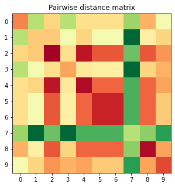

# comparative-genomics

Кудрявцева Полина Сергеевна	

Assemblies: ASM83482v1	ASM83484v1	ASM118871v1	ASM118873v1	ASM379820v1	ASM379822v1	ASM1519065v1	ASM2284v1	ASM906v1	ASM929594v1

Organism: Yersinia pestis (enterobacteria)

#### 0.filter out the plasmids
Скачаем все геномы из базы ncbi и удалим из них плазмиды с помощью команды sed
```
sed -n '/plasmid.*/q;p' GCF_000834825.1_ASM83482v1_genomic.fna > ASM83482v1.fasta
sed -n '/plasmid.*/q;p' GCF_000834845.1_ASM83484v1_genomic.fna > ASM83484v1.fasta
sed -n '/plasmid.*/q;p' GCF_001188715.1_ASM118871v1_genomic.fna > ASM118871v1.fasta
sed -n '/plasmid.*/q;p' GCF_001188735.1_ASM118873v1_genomic.fna > ASM118873v1.fasta
sed -n '/plasmid.*/q;p' GCF_003798205.1_ASM379820v1_genomic.fna > ASM379820v1.fasta
sed -n '/plasmid.*/q;p' GCF_003798225.1_ASM379822v1_genomic.fna > ASM379822v1.fasta
sed -n '/plasmid.*/q;p' GCA_015190655.1_ASM1519065v1_genomic.fna > ASM1519065v1.fasta 
sed -n '/plasmid.*/q;p' GCF_000022845.1_ASM2284v1_genomic.fna > ASM2284v1.fasta
sed -n '/plasmid.*/q;p' GCF_000009065.1_ASM906v1_genomic.fna > ASM906v1.fasta
sed -n '/plasmid.*/q;p' GCF_009295945.1_ASM929594v1_genomic.fna > ASM929594v1.fasta
```
#### 1.construct synteny blocks using Sibelia software [1] for two threshold of minimum block length (5kb and 1kb). Put the blocks files in Supplements.
Сольем все файлы в один и запустим программу Sibelia
```
cat *.fasta > Yersinia_pestis.fasta
Sibelia -s fine -m 5000 Yersinia_pestis.fasta
Sibelia -s fine -m 1000 Yersinia_pestis.fasta
```
Получившиеся файлы лежат в папке Sibelia

#### 2.calculate the number of all blocks, common blocks, repeated blocks. Compare the results for different threshold. Add figures to the report. 
Все вычисления сделаем на питоне. Ноутбук с кодом хранится в этом же репозитории.
Создадим функцию, которая распарсит файлы blocks_coords.txt
```
def parse_blocks(f):
    block = {}
    for i in range(len(f)):
        if f[i].find('Block') == 0:
            idx = f[i][:-1]
            block[idx] = []
            skip_one_row = 1
        elif skip_one_row == 1:
            skip_one_row = 0
        elif f[i][:3] == '---':
            continue
        else:
            block[idx].append(f[i].split('\t')[0])
    return block
    
f = open("5kb/blocks_coords.txt",)
f = f.readlines()
f = f[12:]
block_5kb = parse_blocks(f)

f = open("1kb/blocks_coords.txt",)
f = f.readlines()
f = f[12:]
block_1kb = parse_blocks(f)
```

Посчитаем общее число блоков:
```
len(block_5kb), len(block_1kb)
```
(156, 311)

Посчитаем число блоков, которые есть в каждом геноме:
```
def common_block(block):
    n = 0
    for i in range(1, len(block)+1):
        if len(set(block['Block #' + str(i)])) == 10:
            n += 1
    return n

common_block(block_5kb), common_block(block_1kb)
```
(138, 252)

Посчитаем число блоков, которые повторяются хотя бы в одном геноме:
```
def repeated_block(block):
    n = 0
    for i in range(1, len(block)+1):
        if len(set(block['Block #' + str(i)])) != len(block['Block #' + str(i)]):
            n += 1
    return n

repeated_block(block_5kb), repeated_block(block_1kb)
```
(2, 19)

Но возможно в общие и повторяющиеся блоки нужно считать с помощью Sibelia c параметром -a.

Тогда число общих блоков для 5kb - 133, а повторяющихся - (156 - 133) = 23. Для 1kb общих блоков - 133, а повторяющихся - (311 - 133) = 178.
Разница в том что в общих блоках я учла и те что повторяются.


В итоге, как и ожидалось, при минимальном размере блока в 5kb было найдено меньшее число блоков, но большая доля из них представлена в каждом геноме. Также очень малое количество блоков длиной более 5kb повторяются в геномах.

#### !Then for 1kb calculations
#### 3.visualize the plots where each point represents a block, y coordinate – it’s length, x – it’s frequency. Add figures in the report.

Достанем из файла длину блоков и вычислим среднюю длину каждлго блока и уникальное число геномов, в которых он представлен:
```
def parse_blocks_length(f):
    block = {}
    for i in range(len(f)):
        if f[i].find('Block') == 0:
            idx = f[i][:-1]
            block[idx] = []
            skip_one_row = 1
        elif skip_one_row == 1:
            skip_one_row = 0
        elif f[i][:3] == '---':
            continue
        else:
            block[idx].append(int(f[i].split('\t')[4][:-1]))
    return block
    
block_1kb_len = parse_blocks_length(f)

for i in range(1, len(block_1kb_len)+1):
    block_1kb_len['Block #' + str(i)] = int(sum(block_1kb_len['Block #' + str(i)])/len(block_1kb_len['Block #' + str(i)]))

block_1kb_freq = {}
for i in range(1, len(block_1kb)+1):
    block_1kb_freq['Block #' + str(i)] = len(set(block_1kb['Block #' + str(i)]))
```


#### 4.for the longest common block and the longest rare block (found in two strains) describe the gene composition. Do the genes form operons? Add figures to the report.

Наиболее редкий и длинный блок 311, самый длинный и частый блок 228. Сохраним их координаты в словарь и загрузим аннотацию генома, чтобы посмотреть какие гены находятся в этих блоках.

```
in_handle = open('GCF_000022845.1_ASM2284v1_genomic.gff')
for rec in GFF.parse(in_handle):
    print(rec)
in_handle.close()

#block 311
for i in range(len(rec.features)):
    if rec.features[i].location.start > 34621 and rec.features[i].location.end < 41383 and rec.features[i].strand == -1:
        print(rec.features[i].qualifiers['Name'])
 
block 228
for i in range(len(rec.features)):
    if rec.features[i].location.start > 1987303 and rec.features[i].location.end < 2069408:
        print(rec.features[i].qualifiers['Name'])
```
Во самом популярном блоке нашлись гены, составляющие опероны:
- rstA и rstB (two-component system response regulator)
- pntA и pntB (Re/Si-specific NAD(P)(+) transhydrogenase subunit alpha and beta)
и другие

В самом редком блоке есть гены:
- YPZ3_RS00185 (transposase), YPZ3_RS00190 (transposase)
Блок короткий, поэтому генов немного. Нашлись только плохо проаннотированные транспозазы.

#### 5.construct pairwise distance matrix using number of common synteny blocks as a evolutionary distance, visualize the heat map. Add the figure to the report.

Сохраним к каждому блоку множество геномов, которые в них встретились. Далее для каждого генома сохраним блоки, которые он содержит. Посчитаем попарное пересечение множеств блоков для каждых геномов и нарисуем картинку.

```
block_1kb_set = {}
for i in range(1, len(block_1kb)+1):
        block_1kb_set['Block #' + str(i)] = set(block_1kb['Block #' + str(i)])
        
gen_set = defaultdict(set)
for k, v in block_1kb_set.items():
    for g in v:
        gen_set[int(g)].add(k)
        
res = [[0 for _ in range(10)] for _ in range(10)]
for i in range(1, 11):
    for j in range(1, 11):
        res[i-1][j-1] = len(gen_set[i].intersection(gen_set[j]))
```



#### 6.Find a pair of the most distant genomes (use random one in case of several equal meanings). Visualize whole-genome alignment using dotplot [2], reconstruct scenario of inversions [3]. Calculate length of inversions. For the longest one find the repeats that might be substrates of recombination.

Найдем самые близкие и самые далекие геномы:
```
max_d = 0
max_g = []
for i in range(0,10):
    for j in range(0,10):
        if max_d < res[i][j] and i != j:
            max_d = res[i][j]
            max_g = [i, j]
```

Получилось, что геномы 2 (ASM1519065v1), 4 (ASM379820v1) - самые далекие. Это же мы видели на иллюстрации выше. Номера геномов были сгенерированы Sibelia, согласно порядку в файле.

Dotplot выглядит так:


[1] http://bioinf.spbau.ru/sibelia
Ключи запуска
-m отвечает за длину блока,
-s fine используется для близких геномов,
-a оставляет только общие блоки.

[2] https://bioinfo.lifl.fr/yass/yass.php
Запуск со стандартными параметрами

[3] http://grimm.ucsd.edu/cgi-bin/grimm.cgi
Алгоритм реконструирует только инверсии, поэтому на вход принимает только общие однокопийные блоки.
